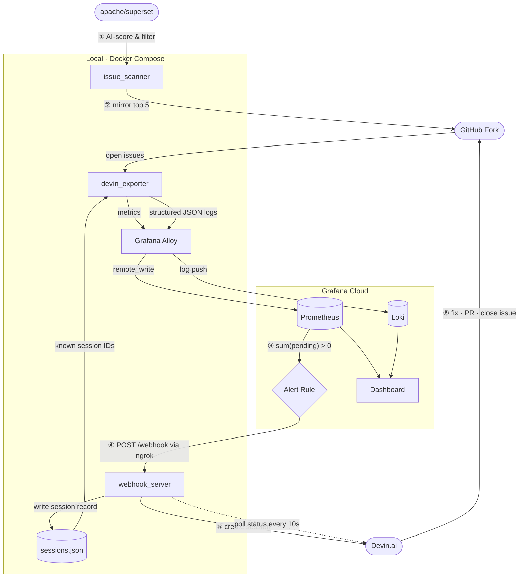

# devin-autoremediation

An event-driven pipeline that automatically identifies fixable issues from [apache/superset](https://github.com/apache/superset), mirrors them to a fork, dispatches [Devin.ai](https://devin.ai) to investigate and fix each one, and visualizes the entire workflow end-to-end in Grafana Cloud — with zero human intervention between alert and pull request.

---

## How It Works



1. **Issue Scanner** fetches open issues from `apache/superset`, applies a keyword pre-filter, then scores the top candidates semantically with Claude AI. The top 5 are mirrored to your fork with idempotency (won't re-mirror the same upstream issue twice).

2. **Devin Exporter** polls GitHub for open fork issues and cross-references the local session store to compute `devin_pending_issues_total` — open issues with no active Devin session. Alloy ships this metric to Grafana Cloud.

3. **Grafana Cloud Alert** fires when `sum(devin_pending_issues_total) > 0` and sends a webhook to `webhook_server` via an ngrok tunnel.

4. **Webhook Server** receives the alert, fetches all open fork issues, and calls the Devin API for any issue not already tracked in the session store. Two idempotency layers prevent duplicate sessions: an in-flight lock (within the process) and the persistent session store (across restarts).

5. **Devin** clones the repo, investigates the issue, implements a minimal fix, opens a pull request with `Closes #N` in the description, and closes the fork issue directly.

6. **Session polling** runs every 10 seconds, updating each session's status and PR URL in the store. As sessions complete and issues close, `devin_pending_issues_total` falls back to zero and the alert resolves.

---

## Tech Stack

| Layer | Technology | Role |
|-------|-----------|------|
| **Issue Discovery** | Python + Claude (`claude-sonnet-4-6`) | Fetches and semantically scores apache/superset issues |
| **Source Control** | GitHub REST API + GraphQL | Mirrors issues, tracks PRs, demo reset (issue deletion) |
| **AI Agent** | [Devin.ai](https://devin.ai) v3 API | Autonomous code investigation, fix, and PR creation |
| **Metrics** | Prometheus (custom exporter) | Exposes session state, PR counts, ACU consumption |
| **Log + Metric Shipping** | [Grafana Alloy](https://grafana.com/oss/alloy/) | Tails structured JSON logs → Loki; remote_writes metrics → Prometheus |
| **Observability Backend** | [Grafana Cloud](https://grafana.com/products/cloud/) | Prometheus, Loki, dashboards, alerting |
| **Alert Trigger** | Grafana Alerting + PromQL | Evaluates `sum(devin_pending_issues_total) > 0` |
| **Webhook Receiver** | FastAPI (Python) | Receives Grafana alerts, triggers Devin sessions |
| **Tunnel** | [ngrok](https://ngrok.com) | Exposes local webhook_server to Grafana Cloud |
| **Containerization** | Docker Compose | Orchestrates all services with shared volumes |

---

## Repository Structure

```
devin-autoremediation/
├── issue_scanner/          # On-demand: AI-filters and mirrors superset issues to fork
│   ├── scanner.py
│   ├── github_client.py
│   └── requirements.txt
├── webhook_server/         # Always running: receives Grafana webhooks, triggers Devin
│   ├── main.py
│   ├── routes.py           # Webhook handler, session poller
│   ├── devin_client.py     # Devin v3 API calls
│   ├── session_store.py    # Persistent JSON session store
│   ├── models.py
│   └── requirements.txt
├── devin_exporter/         # Always running: Prometheus metrics exporter
│   ├── exporter.py         # DevinCollector — pipeline + v3 enterprise metrics
│   ├── devin_client.py
│   ├── github_client.py
│   └── requirements.txt
├── demo_reset/             # On-demand: wipes fork issues, PRs, branches, session store
│   └── reset.py
├── grafana_updater/        # One-shot on startup: patches Grafana contact point URL
│   └── updater.py
├── observability/
│   ├── alloy/config.alloy  # Alloy pipeline: logs → Loki, metrics → Prometheus
│   └── grafana/            # Dashboard JSON
├── tests/                  # Webhook server unit tests (respx mocks, no real tokens)
├── docker-compose.yml
├── .env.example
└── README.md
```

---

## Prerequisites

- **Docker + Docker Compose**
- **GitHub personal access token** — scopes: `repo`, `read:user`, `delete_repo` (delete needed for GraphQL issue deletion in demo reset)
- **[Devin API key](https://app.devin.ai/settings/api)** and your Devin org ID (`org-xxx` format)
- **[Anthropic API key](https://console.anthropic.com)** — used by issue_scanner for AI scoring
- **[Grafana Cloud account](https://grafana.com/auth/sign-up)** — free tier works
- **[ngrok account](https://ngrok.com)** + authtoken — free tier works
- **Grafana service account token** with Editor role — create at `https://<stack>.grafana.net` → Administration → Service accounts

---

## Quick Start

### 1. Fork apache/superset

Fork [apache/superset](https://github.com/apache/superset) to your GitHub account. Note the full name (e.g. `yourname/superset`).

### 2. Clone this repo and configure environment

```bash
git clone https://github.com/yourname/devin-autoremediation
cd devin-autoremediation
cp .env.example .env
```

Fill in `.env`:

| Variable | Where to find it |
|----------|-----------------|
| `GITHUB_TOKEN` | GitHub → Settings → Developer settings → Personal access tokens |
| `GITHUB_FORK_REPO` | Your fork, e.g. `yourname/superset` |
| `DEVIN_API_KEY` | app.devin.ai → Settings → API |
| `DEVIN_ORG_ID` | app.devin.ai → Settings → API (format: `org-xxx`) |
| `ANTHROPIC_API_KEY` | console.anthropic.com |
| `NGROK_AUTHTOKEN` | dashboard.ngrok.com → Your authtoken |
| `GRAFANA_URL` | Your Grafana Cloud stack URL, e.g. `https://yourstack.grafana.net` |
| `GRAFANA_SA_TOKEN` | Grafana → Administration → Service accounts → Add token (Editor role) |
| `GRAFANA_CLOUD_PROMETHEUS_URL` | Grafana Cloud → Connections → your Prometheus details |
| `GRAFANA_CLOUD_LOKI_URL` | Grafana Cloud → Connections → your Loki details |

### 3. Configure Grafana Cloud (one-time)

**Add data sources:**
- **Prometheus**: use `GRAFANA_CLOUD_PROMETHEUS_URL` + username/API key from `.env`
- **Loki**: use `GRAFANA_CLOUD_LOKI_URL` + username/API key from `.env`

**Import the dashboard:**
- Grafana → Dashboards → Import → upload `observability/grafana/dashboard.json`

> The Grafana alert rule and webhook contact point are pre-provisioned. The contact point URL is automatically patched with the live ngrok URL each time you run `docker compose up`.

### 4. Start the stack

```bash
docker compose up -d
```

Services started:

| Service | Port | Description |
|---------|------|-------------|
| `webhook_server` | `8000` | Receives Grafana alerts, triggers Devin |
| `devin_exporter` | `9090` (localhost) | Prometheus metrics endpoint |
| `alloy` | — | Ships logs → Loki, metrics → Prometheus |
| `ngrok` | `4040` | Public HTTPS tunnel to webhook_server |
| `grafana_updater` | — | Patches Grafana contact point URL, then exits |

### 5. Run an issue scan

```bash
docker compose --profile scan run --rm issue_scanner
```

This fetches issues from `apache/superset`, scores them with Claude AI, and mirrors the top 5 to your fork. Within one Grafana alert evaluation cycle (~1 minute), the alert fires and Devin sessions start automatically.

---

## Demo Flow

```
docker compose up -d
        │
        ▼  grafana_updater patches contact point URL
        │
docker compose --profile scan run --rm issue_scanner
        │
        ▼  5 issues mirrored to fork
        │
Grafana evaluates sum(devin_pending_issues_total) > 0
        │
        ▼  alert fires → POST /webhook via ngrok
        │
webhook_server triggers 5 Devin sessions (one per issue)
        │
        ▼  Devin investigates, fixes, opens PRs, closes issues
        │
devin_pending_issues_total → 0  →  alert resolves
        │
        ▼
Grafana dashboard shows sessions, statuses, PR links
```

**Expected timeline:** Issues appear in Grafana dashboard within ~2 minutes of scan. PRs typically opened by Devin within 10–30 minutes depending on issue complexity.

---

## Prometheus Metrics

### Pipeline metrics (scoped to current run via `sessions.json`)

| Metric | Labels | Description |
|--------|--------|-------------|
| `devin_pending_issues_total` | `issue_number`, `issue_url` | Open fork issues with no active Devin session — **alert trigger** |
| `devin_session_total` | `status` | Session count by status (`new`, `running`, `exit`, `error`, …) |
| `devin_session_duration_seconds` | `session_id`, `title`, `status` | Wall-clock duration per session |
| `devin_session_acus_consumed` | `session_id`, `title`, `status` | ACUs consumed per session |
| `devin_session_status_info` | `session_id`, `title`, `status`, `status_detail` | Info gauge (value=1) for current session state |
| `devin_session_pr_info` | `session_id`, `title`, `issue_url`, `pr_url`, `status` | Info gauge (value=1) for sessions that produced a PR |
| `devin_pr_created_total` | — | Total sessions that produced a pull request |

### v3 Enterprise metrics (requires enterprise Devin plan)

| Metric | Description |
|--------|-------------|
| `devin_usage_sessions_count` | Sessions started in window |
| `devin_usage_prs_created_count` | PRs created in window |
| `devin_usage_prs_merged_count` | PRs merged in window |
| `devin_sessions_with_merged_prs_count` | Sessions that produced a merged PR |
| `devin_avg_acus_per_session` | Average ACUs per session |
| `devin_acus_consumed_total` | Total ACUs in window |
| `devin_acus_by_product_latest` | ACUs by product on most recent day |

---

## Resetting for a Fresh Demo Run

```bash
docker compose --profile reset run --rm demo_reset
docker compose restart webhook_server devin_exporter
```

The reset script:
1. **Deletes** all mirrored issues from the fork via GitHub GraphQL (permanent deletion, not just closing)
2. **Closes** any open Devin-created PRs and **deletes** their branches
3. **Clears** `sessions.json` with an atomic write

After restart, run the scanner again to begin a clean demo cycle. The same upstream issues will be mirrored as new issue numbers, with no idempotency collisions.

> **Before resetting:** End any active Devin sessions from the Devin UI. The API does not support session termination, and running sessions may continue pushing to branches after reset.

---

## Checking Status

```bash
# Service health
curl localhost:8000/health

# All tracked Devin sessions
curl localhost:8000/sessions | jq

# Raw Prometheus metrics
curl localhost:9090/metrics | grep devin_

# Live logs
docker compose logs -f webhook_server
docker compose logs -f devin_exporter
docker compose logs -f alloy
```

---

## Testing

Tests live in `tests/` and cover `webhook_server` only. All HTTP calls are mocked with `respx` — no real tokens or network needed.

**What's tested:**
- `GET /health` → 200 OK
- `POST /webhook` with no firing alerts → no GitHub or Devin calls made
- Invalid JSON body → 400; invalid HMAC signature → 401
- Firing alert → one GitHub issue fetch + one Devin session created; session appears in `GET /sessions`
- Duplicate webhook for same issue → no second Devin session (idempotency)

```bash
python3 -m venv .venv && source .venv/bin/activate
pip install -r webhook_server/requirements.txt -r requirements-dev.txt
python -m pytest -c tests/pytest.ini -v
```

---

## Troubleshooting

| Symptom | Resolution |
|---------|-----------|
| No metrics in Grafana | `curl localhost:9090/metrics` to verify exporter is up; `docker compose logs alloy` to check shipping |
| Webhook not triggering | `docker compose logs grafana_updater` — contact point URL may not have been set; check `docker compose logs ngrok` |
| Contact point URL stale after network change | `docker compose up -d` — `grafana_updater` re-patches on every startup |
| Alert stays in Error state | Check alert rule query in Grafana — confirm `devin_pending_issues_total` exists in Prometheus |
| No issues mirrored | `docker compose --profile scan logs issue_scanner`; verify `GITHUB_TOKEN` has `repo` write access to fork |
| Devin session not created | Verify `DEVIN_API_KEY` and `DEVIN_ORG_ID`; check `curl localhost:8000/sessions` |
| `externally-managed-environment` pip error | Use a venv (see Testing section); do not install into system Python |
| `docker compose restart` doesn't pick up `.env` changes | Use `docker compose up -d --force-recreate` instead |
